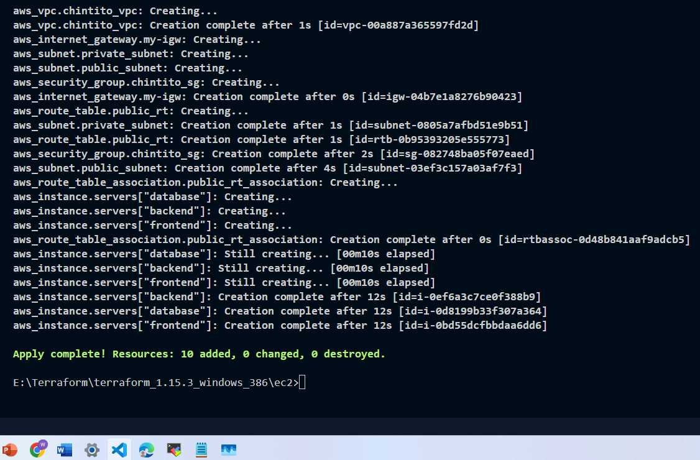
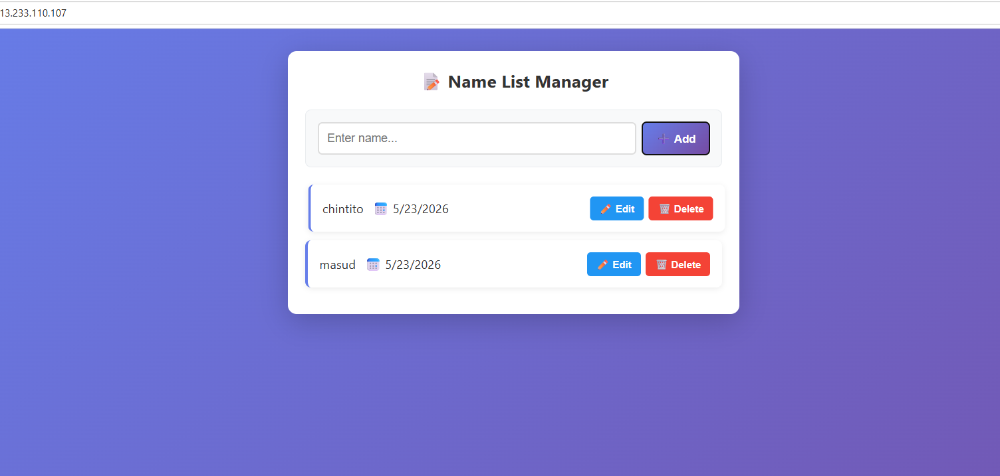

# module_06_terraform_ostad

# installation Terraform CLI :  For windows 
Install the terraform cli :
Link : https://releases.hashicorp.com/terraform/1.15.4/terraform_1.15.4_windows_386.zip

## instrallation AWS CLI :
https://awscli.amazonaws.com/AWSCLIV2.msi
main.tf
```
terraform {
  required_version = ">= 1.5.0"
  required_providers {
    aws = {
      source  = "hashicorp/aws"
      version = "~> 5.0"
    }
  }
}

provider "aws" {
  region = "ap-south-1"
}


data "aws_ami" "ubuntu" {
  most_recent = true
  owners      = ["099720109477"] # Canonical

  filter {
    name   = "name"
    values = ["ubuntu/images/hvm-ssd-gp3/ubuntu-noble-24.04-amd64-server-*"]
  }

  filter {
    name   = "virtualization-type"
    values = ["hvm"]
  }
}


resource "aws_instance" "servers" {

  for_each = {
    frontend = {
      instance_type = "t3.micro"
      user_data     = <<-EOF
        #!/bin/bash

        sudo apt update -y
        sudo apt install nginx -y

        sudo systemctl enable nginx
        sudo systemctl start nginx
      EOF
    }

    backend = {
      instance_type = "t3.micro"
      user_data     = <<-EOF
        #!/bin/bash

        sudo apt update -y

        curl -fsSL https://deb.nodesource.com/setup_22.x | sudo -E bash -

        sudo apt install -y nodejs
        sudo apt install -y npm

        node -v
        npm -v
      EOF
    }

    database = {
      instance_type = "t3.micro"

      user_data = <<-EOF
    #!/bin/bash

    set -e

    echo "Updating system..."
    sudo apt-get update -y

    echo "Adding MongoDB repo..."
    echo "deb [ arch=amd64,arm64 signed-by=/usr/share/keyrings/mongodb-server-7.0.gpg ] https://repo.mongodb.org/apt/ubuntu jammy/mongodb-org/7.0 multiverse" | \
    sudo tee /etc/apt/sources.list.d/mongodb-org-7.0.list

    echo "Fixing GPG key..."
    sudo rm -f /usr/share/keyrings/mongodb-server-7.0.gpg

    curl -fsSL https://pgp.mongodb.com/server-7.0.asc | \
    sudo gpg --dearmor -o /usr/share/keyrings/mongodb-server-7.0.gpg

    echo "Updating package list again..."
    sudo apt update -y

    echo "Upgrading system..."
    sudo apt-get upgrade -y

    echo "Installing MongoDB..."
    sudo apt install -y mongodb-org

    echo "Starting MongoDB..."
    sudo systemctl start mongod

    echo "Enabling MongoDB on boot..."
    sudo systemctl enable mongod

    echo "Changing bindIp to 0.0.0.0..."
    sudo sed -i 's/bindIp: 127.0.0.1/bindIp: 0.0.0.0/' /etc/mongod.conf

    echo "Restarting MongoDB..."
    sudo systemctl restart mongod

    echo "MongoDB setup complete!"
  EOF
    }
  }

  ami                    = data.aws_ami.ubuntu.id
  instance_type          = each.value.instance_type
  subnet_id              = aws_subnet.public_subnet.id
  vpc_security_group_ids = [aws_security_group.chintito_sg.id]

  key_name                    = "private_asia_masud"
  associate_public_ip_address = true

  user_data = each.value.user_data

  tags = {
    Name = each.key
  }
}

resource "aws_vpc" "chintito_vpc" {
  cidr_block = "10.0.0.0/16"
  tags = {
    Name = "chintito_vpc_terraform"
  }
}

resource "aws_security_group" "chintito_sg" {

  name        = "chintito_masud"
  description = "Security Group Created By masudur rahman"
  vpc_id      = aws_vpc.chintito_vpc.id
  #SSh Access
  ingress {
    from_port   = 22
    to_port     = 22
    protocol    = "tcp"
    cidr_blocks = ["0.0.0.0/0"]
  }

  # Http access
  ingress {
    from_port   = 80
    to_port     = 80
    protocol    = "tcp"
    cidr_blocks = ["0.0.0.0/0"]
  }
  ingress {
    from_port   = 443
    to_port     = 443
    protocol    = "tcp"
    cidr_blocks = ["0.0.0.0/0"]
  }
  egress {
    from_port   = 0
    to_port     = 0
    protocol    = "-1"
    cidr_blocks = ["0.0.0.0/0"]
  }
  tags = {
    Name = "chintito_sg_terraform"
  }

}


#public subnet
resource "aws_subnet" "public_subnet" {
  vpc_id            = aws_vpc.chintito_vpc.id
  cidr_block        = "10.0.1.0/24"
  availability_zone = "ap-south-1a"
  tags = {
    Name = "chintito_subnet_Public_terraform"
  }
}

resource "aws_subnet" "private_subnet" {
  vpc_id            = aws_vpc.chintito_vpc.id
  cidr_block        = "10.0.12.0/24"
  availability_zone = "ap-south-1a"
  tags = {
    Name = "chintito_subnet_Private_terraform"
  }
}


resource "aws_internet_gateway" "my-igw" {
  vpc_id = aws_vpc.chintito_vpc.id
  tags = {
    Name = "chintito_igw_terraform"
  }
}

resource "aws_route_table" "public_rt" {
  vpc_id = aws_vpc.chintito_vpc.id
  tags = {
    Name = "chintito_public_rt_terraform"
  }
  route {
    cidr_block = "0.0.0.0/0"
    gateway_id = aws_internet_gateway.my-igw.id
  }
}

resource "aws_route_table_association" "public_rt_association" {
  subnet_id      = aws_subnet.public_subnet.id
  route_table_id = aws_route_table.public_rt.id
}


# data "aws_vpc" "specific" {
#   filter {
#     name   = "tag:Name"
#     values = ["chintito_aws-vpc"]
#   }
# }

# output "vpc_id" {
#   value = data.aws_vpc.specific.id
# }

````

## Screenshots
### Terraform EC2 Instance Architecture


### 3-Tier Application Flow

